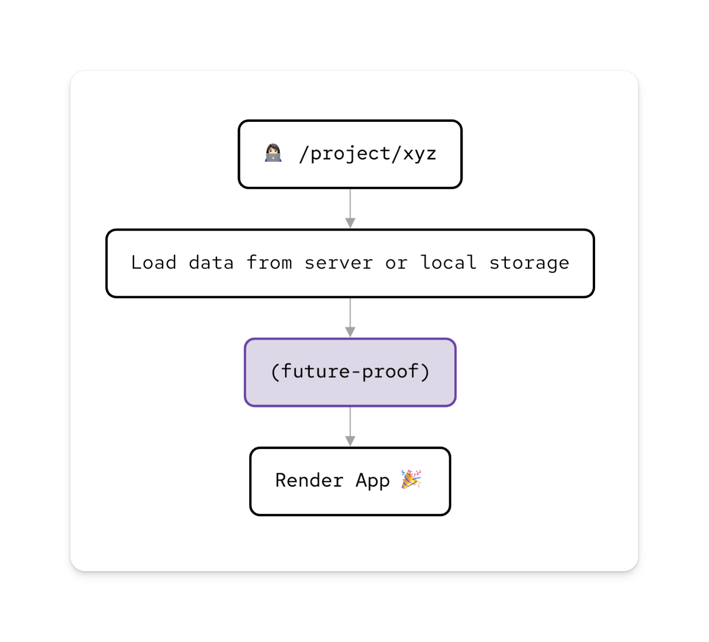

# future-proof

A utility for writing data migration logic in code so you can change the shape of your data confidently as your app evolves.



## Motivation

Usually an app begins with one data shape but over time the shape of data changes. In most apps I've written, the parts which ensure the data is up to data are a tangled mess. I wanted something that ensured my data was up-to-date, was easy to read, and was lightweight enough to run on the client when loading data.

I'm also a frequent user of [Zustand](https://github.com/pmndrs/zustand) persisted stores, so I wrote the API with that in mind. However, it can be used with any data.

## Installation

```shell
pnpm add future-proof # npm install future-proof, yarn add future-proof
```

### How to Use

1. [Define Migration Steps](#define-migration-steps)
2. [Apply Migrations](#apply-migrations)

### Define Migration Steps

You can define your migration steps using the `from` function, which takes an initial state object as a parameter. It returns an object with a fluent interface, allowing you to chain multiple `to` functions to define your migration steps.

Each `to` function takes a callback function that receives the current state object and returns a new state object with the desired changes. You can add as many `to` functions as necessary to transform your data.

To complete the migration, you can call the `now` function with the initial state object. This types your returned state object, and tells `future-proof` what to return if it is called with no parameters.

Here's an example of defining migration steps:

```typescript
// In this example we begin with x and y properties.
// Later on we added z
// Even later we added θ

const { version, migrate } = from({
  x: 100,
  y: 100,
})
  .to((state) => ({
    ...state,
    z: 100,
  }))
  .to((state) => ({
    ...state,
    θ: 0,
  }))
  .now({
    x: 100,
    y: 100,
    z: 100,
    θ: 0,
  });
```

The `now` function returns the current version number and a `migrate` function we can use to ensure our data is up to date.

### Apply Migrations

To apply the migration to your data, you can call the `migrate` function with the data object and it's version. The `migrate` function will return the migrated data object.

Here's an example of applying migration:

```typescript
const data = migrate(
  {
    x: 200,
    y: 200,
  },
  0
);
```

In this example, we pass the data object with `x` and `y` properties, along with the version number `0`. The `migrate` function will return the migrated data object, which includes the properties `x`, `y`, `z`, and `θ`.

### Usage with Zustand

```typescript
import { create } from "zustand";
import { persist } from "zustand/middleware";
import { from } from "future-proof";

type State = { x: number; y: number; z: number; θ: number };
const initialState: State = {
  x: 100,
  y: 100,
  z: 100,
  θ: 0,
};

const { version, migrate } = from({
  x: 100,
  y: 100,
})
  .to((data) => ({ ...data, z: 100 }))
  .to((data) => ({ ...data, θ: 0 }))
  .now(initialState);

const useStore = create<State>()(
  persist((set) => initialState, {
    name: "my-persisted-store",
    version,
    migrate,
  })
);
```
